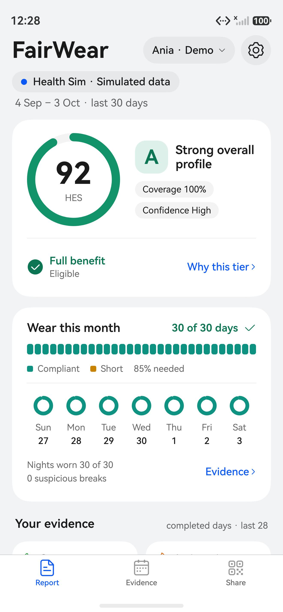
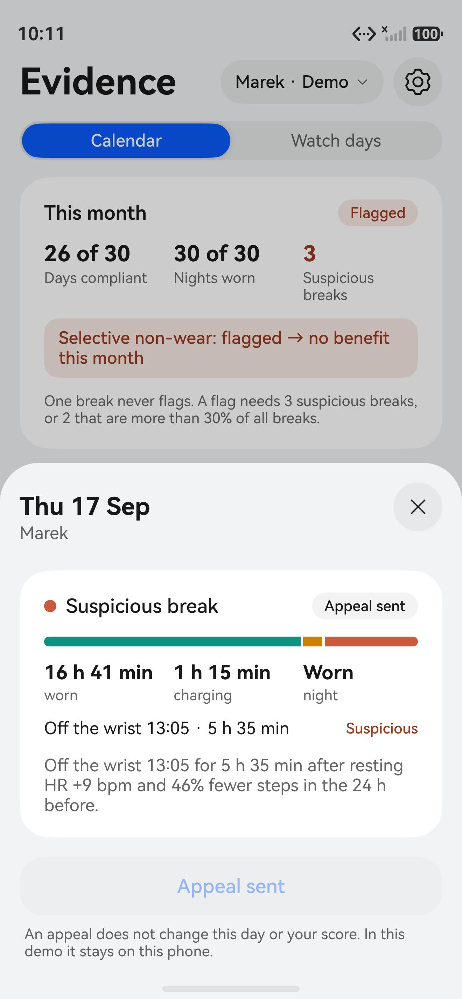
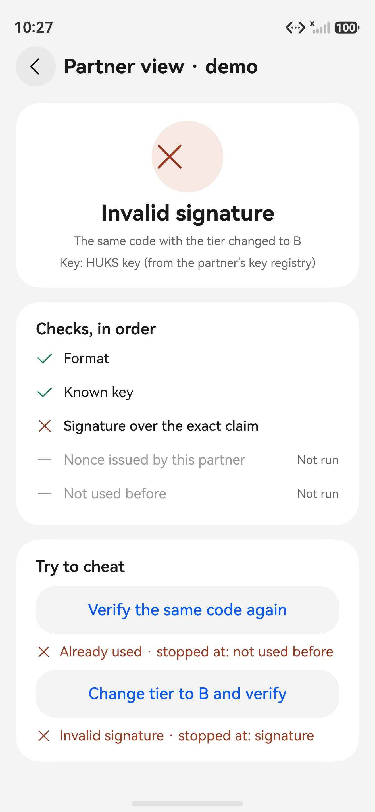
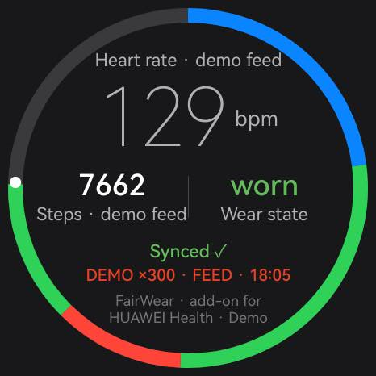

# FairWear

FairWear is an add-on for HUAWEI Health users: with their permission it reads what HUAWEI Health already
measures, scores it on the phone, and shares only a signed tier.

HackYeah 2026, Huawei task. Native ArkTS/ArkUI, minimum API 20. Modules: `entry` (phone), `watch`
(wearable), `common` (shared logic, no UI).

**Who it is for.** People in a wellbeing or insurance programme that rewards healthy habits, and the partner
that runs it. Such programmes take raw wearable data and can be gamed by taking the watch off on bad days.
FairWear keeps raw data on the phone, judges wear with open rules (including selective non-wear: breaks that
follow a raised resting heart rate and fewer steps), lets the user see and appeal each day, and gives the
partner only a signed, single-use A/B/C tier. Lead challenge theme: Human-Centric Technology (responsible
technology, digital wellbeing).

**Demo video:** (link before submission) · **HAP packages:** (link before submission)

<p>




</p>

## For the jury

| Criterion | Where to see it |
| --- | --- |
| Originality | Selective non-wear: Marek and Kasia wear the watch on the same 26 of 30 days, but only Marek's breaks follow a raised resting heart rate and fewer steps, so only he is flagged. The partner gets a signed, single-use A/B/C tier and nothing else. `common/src/main/ets/wear/`, `docs/screenshots/final/a2-evidence-marek-*` |
| Usefulness | For people in a programme that rewards activity and sleep habits, and for the partner that runs it: a benefit without handing over raw health data, a reason for every day and an appeal. Benefits only, never a penalty. "Who it is for" above, `docs/DEMO_SCRIPT.md` |
| Technical execution | 398 logic tests in `common` and 6 in `watch` (`docs/test-results.txt`): HES-Lite and the six personas, the flag rule, strict claim decoding, replay and tamper checks with real ECDSA, the hash chain of watch days. Missing data gives "no score yet", never a guess. Lint 0 errors. |
| Platform capabilities | Sensor Service Kit on the watch, HUKS keys on the phone and the watch, Crypto Architecture Kit, Ability Kit between two apps (Health Sim), Form Kit card, icon shortcut, phone and wearable built from one `common` module. Table "Platform capabilities" below |
| Demo | The video above; the script and plan B in `docs/DEMO_SCRIPT.md`; what is real and what is simulated in the table below |
| Reproducibility | "How to install" below (versions, emulators, commands); the logic tests run on any OS with Node; how AI tools were used in `AI_WORKFLOW.md`, the team's briefs in `docs/prompts/`; requirement by requirement in `docs/REQUIREMENTS_CHECK.md` |

## FairWear as a component

**What it does.** FairWear takes the health history a person already has, turns it into an A/B/C tier on
the phone, and hands a partner only that tier, signed. Raw health data stays on the phone.

**How it integrates with the platform.** FairWear reads from HUAWEI Health through Health Service Kit,
after the user authorizes it in HUAWEI Health and gives FairWear a separate consent to process health data.
Today this is DEMO: access to health data through Health Service Kit has to be granted to the app by
Huawei, and FairWear does not have it. The adapter is a stub, the authorization step is a neutral
placeholder, and every screen states the source in words: "HUAWEI Health · Demo data", "· Not connected" or
"· Unavailable in this build". The connection
can be ended in FairWear ("Disconnect HUAWEI Health") or in HUAWEI Health privacy settings.

**How to install.** Two HAPs, one per device: `entry` on a phone emulator, `watch` on a wearable emulator.

| Tool | Version |
| --- | --- |
| DevEco Studio | 6.1.1.280 (Windows; the scripts run in Git Bash) |
| SDK | HarmonyOS 6.1.1 (API 24), bundled; `compatibleSdkVersion` 6.0.0(20), `targetSdkVersion` 6.1.1(24) |
| Emulators | Phone and Wearable, HarmonyOS 6.1.1 (API 24), from DevEco Studio's Device Manager |
| ohpm, hvigor, hdc, Node | bundled with DevEco Studio; `source tools/env.sh` puts them on the PATH |

1. Emulators. Outside mainland China DevEco Studio lists the phone images only after the region is set to
   China (see the challenge FAQ). Tools → Device Manager → create a Phone and a Wearable device with the
   newest API 24 image and start both; `hdc list targets` then lists two targets.
2. Build, install, start (Git Bash, repository root; set `DEVECO_HOME` if DevEco Studio is not in the default
   folder):

```
source tools/env.sh && ohpm.bat install --all    # once after cloning: links the local common module
tools/deploy.sh entry    # builds entry, installs it on the running phone emulator and starts it
tools/deploy.sh watch    # the same for the wearable emulator
```

The HAPs are written to `entry/build/default/outputs/default/entry-default-unsigned.hap` and
`watch/build/default/outputs/default/watch-default-unsigned.hap`; they can also be installed by hand with
`hdc -t <target> install -r <hap>`. They are unsigned debug builds, which the emulators accept.

**Health Sim (optional, for the full demo).** A second DevEco project in `healthsim/` builds the simulator app
that stands in for HUAWEI Health on the emulators: `com.fairwear.healthsim`, one HAP for the phone and one for
the watch. Build and install steps are in `healthsim/README.md`. With it installed, **Connect HUAWEI Health**
opens Health Sim, which asks for its own consent and hands FairWear the simulated histories of the six people;
on the watch, **Get today from Health Sim** fetches the script of the demo day. Without it FairWear uses its
built-in demo data and says so.

The watch module of Health Sim is built and installed the same way (`healthsim/README.md` describes the phone
module):

```
cd healthsim && source ../tools/env.sh && ohpm.bat install --all
hvigorw.bat assembleHap --mode module -p module=watch@default -p product=default -p buildMode=debug --no-daemon
hdc -t <watch> install -r watch/build/default/outputs/default/watch-default-unsigned.hap
```

Health Sim on the watch does not have to be opened first: FairWear on the watch starts its export ability when
**Get today from Health Sim** is tapped.

**How to check it.** Follow `docs/DEMO_SCRIPT.md`: the whole product in about four minutes (Report, Why,
Evidence with an appeal, Share, the partner check with a replay and a changed tier, the watch and its signed
days), and the connect / consent / disconnect / consent-again path that Huawei asks to see when it verifies an
integration, here with DEMO data.

**Watch: live heart rate and wear state (emulator).** The watch module subscribes to the heart-rate and step-counter sensors and shows three live values: heart rate, steps today and wear state. These values stay on the watch and are not part of the score. The wearable emulator has a heart-rate sensor and a step counter but no wear-detection sensor, so the wear state is derived from heart rate. There is one wear rule on the watch, `WearStateMachine` in `common`, used by the screen and by the Watch Link recorder: charging (from `batteryInfo.pluggedType`) comes first, then the wear-detection sensor when the watch has one, then heart rate. Any reading of 0 or outside 25–230 bpm counts as no reading, and the watch counts as not on wrist after more than 60 s without a valid reading. Only the demo clock shortens that limit (to 3 s), and the dial then shows a `DEMO ×300` label.

What we observed on the emulator with nothing set in the Virtual sensor panel: heart-rate events arrive about 6 times a second with the value 0 (not silence) and the step counter stays at 1000. The screen shows "—" for heart rate, 0 steps today and the wear state "not on wrist" (`docs/screenshots/i3-watch-wear-state.jpeg`). No real heart rate was read on the emulator, and the charging state was not reached there.

**Not run in the emulator's Virtual sensor panel:** in the emulator window open the menu → Virtual sensor and set heart rate to 70, then 0, then 70 again. Expected: 70 shows "70 bpm" and "worn"; after 0 the heart rate changes to "—" at once and the wear state changes to "not on wrist" a little more than 60 s later; 70 brings back "70 bpm" and "worn". This sequence is covered by the Node test (`tools/run-logic-tests.sh common common/src/test/LiveWear.test.ets live`), but it has not been run in the emulator panel.

**Phone: home-screen card and icon shortcut (emulator).** The DevEco phone emulator shows service widgets. Long-press the FairWear icon → Widgets → Add to home screen: the 2x2 card shows the data source, the coverage and whether a score is ready, never the tier. Long-press the icon again: the shortcut "Data source" opens Settings with the data-source card. Both open the app through the same parameter, `fwTarget` (`docs/ARCHITECTURE.md`, "One entry point"). Screenshots: `docs/screenshots/ta1-home-card-phone.jpeg`, `ta1-home-card-after-consent-phone.jpeg`, `ta2-icon-shortcut-phone.jpeg`.

**Watch: demo feed (simulated).** The wearable emulator sends heart rate 0, so a recorded day would be empty. On the watch, page "Watch link": switch on "Demo clock ×300", then "Demo feed". A fixed script of heart rate, steps and charging then replaces the sensor readings: night on the charger, worn hours, one break from 12:00 to 15:00 (recorded as about 12:10–14:55, because the wear rule waits for the last heart rate to go stale), a walk and a workout. The dial reads "DEMO ×300 · FEED" and every value is labelled "demo feed"; the signed day packet carries the clock label `DEMO_X300_FEED`. The script goes through the same wear rule and recorder as real sensor readings. The real sensors still work when the feed is off: set the heart rate in the emulator's Virtual sensor panel. Screenshots: `docs/screenshots/design/after-watch-dial-feed-later.jpeg`, `before-watch-dial.jpeg`.

## What is in this build

- Health source layer, consent logic and the phone add-on screens are in place (`docs/ARCHITECTURE.md`).
- The score is calculated on the phone by HES-Lite v1.0 (`common/src/main/ets/hes/`): deterministic rules and
  curves, no learned model and no network. It runs on the histories of six demo personas, which are synthetic
  and generated from a seed; the source pill on the Report tab reads "HUAWEI Health · Demo data". All weights,
  curves, thresholds and minimum counts are prototype product assumptions, not clinically tested. Description,
  persona results and decisions: `docs/HES.md`.
- Wear rules run next to the score (`common/src/main/ets/wear/`): compliant days, nights, breaks, and the
  selective non-wear flag. One suspicious break never raises the flag, three always do, two only when they
  are more than 30% of all breaks.
- After consent the phone shows three tabs: Report, Evidence and Share. Benefit level: eligible and tier A is
  a full benefit, eligible and tier B a partial benefit, anything else no benefit this month, always shown
  with its reason.
- Report: the month of the selected demo persona, and "Why this tier": the components behind the tier as
  Strongest, To improve and Missing data (a missing component is never listed as weak), the one change that
  reaches the next tier, and how the score is calculated. A persona without a score gets "Measured so far"
  and "Needed for a score" with day and night counts instead.
- Demo controls on the Report tab: the Live card shows heart rate and steps labelled "Demo values"; two
  sliders set them and the score does not move. "Close the day" turns the running day into a completed day
  and the score is calculated again; "Reset demo" returns the persona to its starting history.
- Evidence: the wear month as a calendar (compliant, short, suspicious break, no data), with the month's
  figures and the flag rule above it. A tap on a day opens what the watch recorded and the reason the day
  counts as it does. A short or suspicious day can be appealed: "Appeal this day" becomes "Appeal sent". The
  appeal is kept on the phone until the app restarts, is sent nowhere and changes neither the day nor the
  score. The tab also holds the days received from the watch and "How Watch Link works", a six-step tour of
  the newest day the watch sent, with three checks (a changed day, a repeated day, a held-back day) run on a
  copy of the chain.
- Share: the signed tier claim (seven keys) as a QR code, and a demo partner view that verifies it, refuses
  the same code a second time and refuses a code whose tier was changed. The single-use nonce comes from the
  partner verifier, which in the demo runs inside the same app. Each code shown is written to a ledger in
  the app sandbox with its exact text. A persona without a score gets no code.
- "What left this phone" (link on the Share tab) lists every code the phone has shown, newest first, with its
  exact text and size.
- Not built: export and deletion of the data, a camera scan of the QR code (the partner view takes the code
  from the same phone).
- The screens get their data in one place, `entry/src/main/ets/report/ServiceLocator.ets`, from the engine
  (`EngineReportService`): the report of a persona, the details of each day of the wear month with the reason
  as text, the live readings, "Close the day" and reset.

## What is real and what is simulated

| Part                              | State                                                                                                                                                                                                        |
| --------------------------------- | ------------------------------------------------------------------------------------------------------------------------------------------------------------------------------------------------------------ |
| Score (HES-Lite), tier, coverage  | **Real** engine, calculated on the phone. The history it runs on is **synthetic**: six demo personas generated from a seed.                                                                                  |
| Wear compliance and the flag      | **Real** rules, on a **synthetic** 30-day wear record per persona.                                                                                                                                           |
| Live heart rate and today's steps | Shown, **never scored**. The score uses completed days only; today's steps enter the history when the day is closed, the live heart rate is never stored.                                                    |
| VO₂max and HRV                    | Watch measurements that HES-Lite uses when they are present, as percentiles. In the personas they are **synthetic**. A missing one lowers coverage and never the score.                                      |
| HUAWEI Health connection          | **Health Sim**, our own simulator app (`healthsim/`, bundle `com.fairwear.healthsim`), stands in for HUAWEI Health on the emulators; FairWear asks it for data with `startAbilityForResult` after its consent; without it, built-in demo data. The adapter for the real Health Service Kit stays a **stub** until Huawei grants the app access; FairWear does not copy Huawei's screen.                        |
| Watch to phone                    | Signed day packets carried by a development relay over `hdc` (`tools/watch-phone-relay.mjs`). The Wear Engine code path exists and was not run: it needs paired devices and Wear Engine approval.            |
| Watch days                        | **Real** recording and signing on the watch while the app is open; on the emulator the recorded days came from the labelled demo feed (the emulator sends heart rate 0). Verified watch days are shown, **not scored**. |
| Claim signature                   | **Real** ECDSA P-256; the key is in HUKS. A software-key fallback, labelled in the UI, exists for devices without HUKS; HUKS worked on both emulators, so it was not exercised.                    |
| Partner                           | A screen in the same app, not a separate system.                                                                                                                                                             |

More detail per part: `docs/ARCHITECTURE.md`, `docs/HES.md`, `docs/WATCH_LINK.md`.

## Tests

```
tools/run-logic-tests.sh common                                          # all pure-logic tests, under Node
tools/run-logic-tests.sh watch                                           # the watch module
tools/run-logic-tests.sh common common/src/test/Health.test.ets health   # one test file
tools/check-wording.sh                                                   # text check over sources and docs
tools/lint.sh                                                            # DevEco CLI lint
# any OS with Node 18+ (paths must be absolute):
npm install --prefix "$HOME/fw-ts" typescript@5
node tools/logic-tests/runner.js "$HOME/fw-ts/node_modules/typescript" "$PWD" common
node tools/logic-tests/runner.js "$HOME/fw-ts/node_modules/typescript" "$PWD" watch
```

| Scenario | Tests |
| --- | --- |
| Consent refused, disconnect, reconnect | `Health.test.ets` |
| Unknown or oversized `fwTarget` | `EntryTarget.test.ets` |
| Exactly seven claim keys, strict decode | `Claim.test.ets`, `ClaimHardening.test.ets` |
| Changed tier, reused or expired nonce, unknown key, oversized token | `ClaimVerifier.test.ets` (real ECDSA), `ShareFlow.test.ets` |
| No score, so no code | `ShareFlow.test.ets` |
| Flag rule (one never, three always, two above 30% of breaks) | `WearMonth.test.ets`, `Claim.test.ets` |
| HES-Lite specification, persona results | `Hes.test.ets`, `HesPersonas.test.ets`, `EngineReports.test.ets` |
| Close the day and reset | `HesSession.test.ets`, `EngineReports.test.ets` |
| Changed, repeated or held-back watch day; pause; forget | `WatchLink.test.ets`, `WatchLinkFlow.test.ets`, `LinkProbe.test.ets` |
| Heart rate 0 or out of range | `LiveWear.test.ets` |

Results are recorded in `docs/test-results.txt`. The Node run compiles the `.ets` files as strict TypeScript
with the compiler bundled in DevEco Studio; it does not replace the ArkTS compiler or a run on a device.

## Platform capabilities

| Capability | Kit or API | Where | How to see it |
| --- | --- | --- | --- |
| Heart rate, pedometer, wear detection, charging | Sensor Service Kit, Basic Services `batteryInfo` | `watch/src/main/ets/sensors/LiveSensors.ets` | the watch dial |
| Runtime permissions with reasons | Ability Kit | `watch/src/main/module.json5` | `docs/screenshots/watch-01…02` |
| Keys in the system keystore | Universal Keystore Kit (HUKS), ECDSA P-256: the phone's claim key and the watch's day key | `common/src/main/ets/platform/ProofSigner.ets` | Share › Technical details, "HUKS key" |
| Signature checks, hashing, random numbers | Crypto Architecture Kit | `common/src/main/ets/platform/DeviceCrypto.ets`, `DeviceRandom.ets` | the partner checks |
| Home-screen card | Form Kit | `entry/src/main/ets/entryformability/` | `docs/screenshots/ta1-*` |
| Icon shortcuts, one entry point | Want parameter `fwTarget` | `entry/src/main/ets/nav/EntryRouter.ets` | `docs/screenshots/ta2-*` |
| QR code | ArkUI `QRCode` | `entry/src/main/ets/view/ShareView.ets` | `docs/screenshots/final/a4-share-*` |
| Watch → phone on real devices | Wear Engine Kit (send path) | `watch/src/main/ets/watchlink/WearEngineTransport.ets` | not run: needs paired devices and approval |
| One app asks another for data and gets a result | Ability Kit: `startAbilityForResult`, `terminateSelfWithResult` | `entry/src/main/ets/platform/HealthSimClient.ets`, `watch/src/main/ets/watchlink/WatchLinkRuntime.ets`, `healthsim/` | Connect HUAWEI Health opens Health Sim; `docs/screenshots/final/a1-report-ania-healthsim-light`, `a1-healthsim-fairwear-card-light` |
| HUAWEI Health data | Health Service Kit | `entry/src/main/ets/platform/HuaweiHealthSource.ets` | stub: needs Huawei's approval |

## Security & privacy

- **Phone.** The phone app declares no permissions and has no network code: health history and the score
  never leave the phone. The only output meant for a partner is the signed tier claim. The Watch Link code
  also answers the paired watch with ACK packets (sequence number, status, reason, the hash of the packet
  answered; no health values), signed with the phone's own Watch Link key, which the watch pins at pairing:
  a forged or replayed answer cannot take a day out of the watch's outbox or unpair it.
- **What the signatures prove, and what they do not.** The partner checks that a claim is intact, fresh,
  used once and answers its own nonce, signed by a key it enrolled; it works the key id out from the key and
  never lets a second key take over a key id. The phone checks the same for each watch day, plus the chain.
  What they do not prove yet: that the key sits in a real device's keystore. Keys are enrolled without HUKS
  key attestation, so a key made outside a device could sign any tier; and the score runs on the phone, from
  data the user controls. Next step: the partner checks a HUKS key attestation at enrolment. Watch days travel
  signed, not encrypted: on real devices Wear Engine is the channel; the hdc relay of the demo is a
  development tool.
- **Watch.** Two permissions, `READ_HEALTH_DATA` (heart rate) and `ACTIVITY_MOTION` (steps), each with a
  stated reason and used only while the app is open. A refused permission shows "unavailable" and the wear
  state "no data", never a made-up value (`docs/screenshots/watch-04-heart-rate-permission-denied.jpeg` shows
  the earlier dial). The sensors are
  switched off when the page is hidden.
- **Entry points.** Only the two start abilities are exported; the home-screen card ability is not.
- **Logs.** `%{public}` log fields carry screen names, error texts, counters, key ids and sandbox paths. No
  heart rate, step count or other health value is logged. Check: `git grep -n "%{public}" -- common entry watch`.
- **Dependencies.** `entry` and `watch` depend only on the local `common` module. The two external packages,
  `@ohos/hypium` 1.0.24 and `@ohos/hamock` 1.0.0, are OpenHarmony's test libraries, declared as
  devDependencies for the test sources. The `oh-package-lock.json5` files are committed, so an install
  resolves the same versions by hash.
- **Signing.** The committed `build-profile.json5` has an empty `signingConfigs` list. For a signed HAP let
  DevEco Studio fill it locally (File → Project Structure → Signing Configs → Automatically generate
  signature) and do not commit the changed file.
- **Commit hook.** `tools/hooks/pre-commit` blocks a commit that stages signing material, a local Wear Engine
  config or a password line. Install it once per clone: `cp tools/hooks/pre-commit .git/hooks/pre-commit`.

## Watch Link: signed day packets from the watch

The watch app records the day in 288 five-minute slots (worn, charging, off-wrist, not observed), signs one
summary per day with its own key and chains the summaries by hash. The phone checks the signature and the
chain before it takes a day in, so a day cannot be removed or edited on the way without it showing. The
watch measures; every verdict stays in the rule code on the phone. Specification, demo script and what was
checked: `docs/WATCH_LINK.md`.

```
tools/deploy.sh watch && tools/deploy.sh entry   # debug builds on both emulators
node tools/watch-phone-relay.mjs                 # carries pair.json, day packets and ACKs over hdc
node tools/watch-phone-relay.mjs once --tamper   # demo: the phone answers "Invalid signature"
node tools/watch-phone-relay.mjs once --drop 3   # demo: the phone shows "1 day missing"
```

| Part                      | Real or simulated                                                                                                                                                                                                  |
| ------------------------- | ------------------------------------------------------------------------------------------------------------------------------------------------------------------------------------------------------------------ |
| Watch recorder            | **Real** sensor code (heart rate, steps, wear sensor when present; heart-rate signal on the emulator). Records **while the app is open**.                                                                          |
| Day packets               | **Real** ECDSA P-256 signing on the watch (HUKS on the wearable emulator, software fallback otherwise) and a hash chain.                                                                                           |
| Watch → phone transport   | Wear Engine **send path** in code (the ACK return is not wired), **not demonstrable** on emulators (needs paired devices and Wear Engine approval) and not run. The demo uses `tools/watch-phone-relay.mjs` over hdc, carrying the identical files. |
| Demo clock ×300           | **Simulated time**, labelled on the watch and in every packet recorded with it.                                                                                                                                    |
| 24 h background recording | **Not implemented.** No continuous-task type fits health logging. In the product the full-day history comes from HUAWEI Health; the watch app adds signed wear evidence while it runs.                             |
| Watch days in the score   | **Shown, not scored.** The score runs on the persona histories; the phone shows the received days and their source next to it.                                                                                     |
